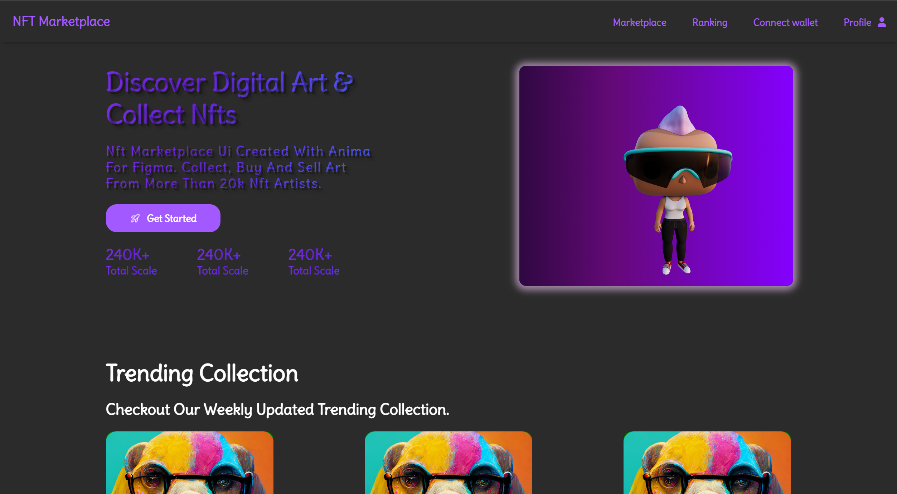
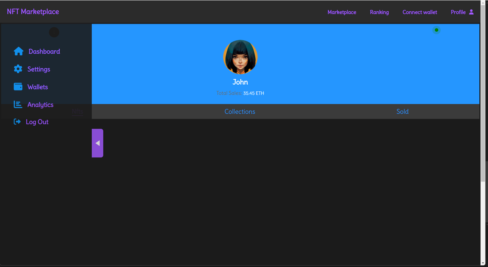
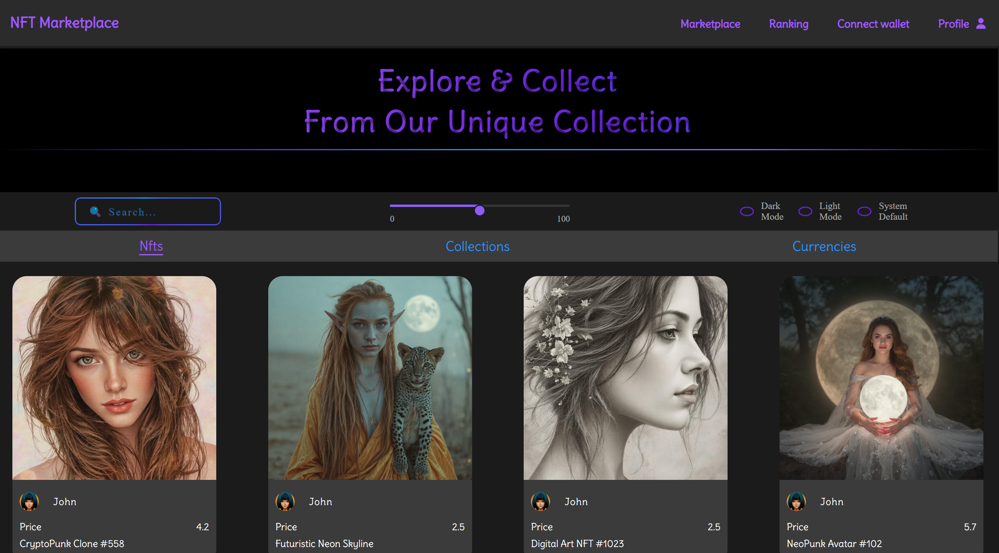

# MERN Stack Project

## Project Status

🚧 Not Finished – Still in Development 🚧

## Overview

This is a full-stack MERN (MongoDB, Express.js, React, Node.js) project built with modern web technologies and best practices. The application leverages:

- **React 18** for the frontend
- **Node.js (18-20)** for the backend
- **Redux Toolkit** for state management
- **FSD (Feature-Sliced Design) architecture** for better scalability
- **SCSS** for styling
- **Three.js** for rendering 3D models
- **TypeScript** for both frontend and backend
- **JWT authentication** for secure user sessions
- **MongoDB Atlas** as the cloud database
- **Express Validator & bcrypt** for user authentication and input validation
- **OOP (Object-Oriented Programming) principles** in backend logic
- **CI/CD pipeline** for seamless deployment

## Features

- 🔥 **Full authentication system** (Register, Login, Logout) using JWT
- 🏗 **Modular FSD architecture** for scalability
- 🎨 **Interactive 3D visualization** using Three.js
- 📦 **State management** with Redux Toolkit
- 🔐 **Secure authentication** with bcrypt and JWT
- 🛠 **Robust validation** using Express Validator
- 🚀 **CI/CD pipeline** for automated testing and deployment
- 📡 **Cloud database** hosted on MongoDB Atlas

## Tech Stack

| Technology        | Purpose                 |
| ----------------- | ----------------------- |
| React 18          | Frontend UI             |
| Node.js 18-20     | Backend API             |
| Express.js        | Server-side framework   |
| MongoDB Atlas     | Cloud Database          |
| Redux Toolkit     | State Management        |
| TypeScript        | Type Safety             |
| SCSS              | Styling                 |
| Three.js          | 3D Model Rendering      |
| JWT               | Authentication          |
| Bcrypt            | Password Hashing        |
| Express Validator | Request Validation      |
| CI/CD             | Deployment & Automation |

## Installation

```bash
# Clone the repository
git clone https://github.com/your-repo.git
cd your-repo

# Install backend dependencies
cd backend
npm install

# Install frontend dependencies
cd ../frontend
npm install
```

## Running the Project

```bash
# Start the backend server
cd backend
npm run dev

# Start the frontend
cd ../frontend
npm start
```

## Environment Variables

Create a `.env` file in the backend folder with the following variables:

```env
PORT=5000
MONGO_URI=your_mongodb_atlas_url
JWT_SECRET=your_secret_key
```

## CI/CD Pipeline

This project includes a CI/CD pipeline for automated testing and deployment. The pipeline integrates with GitHub Actions (or any preferred CI/CD tool) to:

- Run tests
- Lint and format code
- Deploy automatically on merge

## Screenshots & GIFs

### 🎨 3D Model Display



### 🔐 Profile page



### 📊 Marketplace



## License

This project is open-source and available under the [MIT License](LICENSE).

## Contributing

Contributions are welcome! Feel free to submit issues or pull requests.

## Contact

For questions or support, reach out at [amramananyan9@gmail.com](mailto:amramananyan9@gmail.com).
